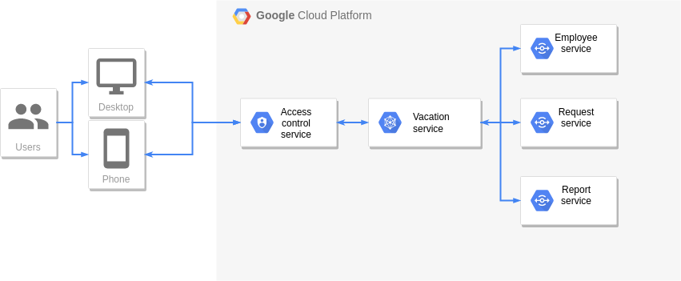

### Project diagram

### Domain and context

**Создание и проведение запроса (на отпуск или компенсацию):**

Сотрудник

Менеджер

Запрос

**Просмотр балансов отпусков:**

Баланс

Сотрудник

**Просмотр списка запросов пользователем или менеджером:**

Сотрудник

Фильтр

Список запросов

**Получение отчётов (по доступным балансам, использованным дням отпуска, скомпенсированным дням отпуска, и т. д.)**

Менеджер

Отчёт

Вид отчёта

Фильтр

### User stories

Пользователь заводит запрос. Его одобряет менеджер. Пользователь отгуливает отпуск.

Пользователь отменяет заведённый ранее запрос, т.к. у него изменились планы.

Пользователь просматривает балансы отпусков, чтобы проконтролировать сколько дней у него было потрачено, и сколько ещё осталось.

Пользователь просматривает список своих запросов.

Менеджер получает список запросов, ожидающих его одобрения. Выбирает один запрос и одобряет его. Выбирает второй, и отклоняет.

Менеджер просматривает балансы отпусков своего подчинённого, чтобы проконтролировать, сколько дней отпуска у него осталось.

Менеджер задаёт параметры фильтра для выборки своих подчинённых, выбирает тип отчёта и получает отчёт на основе данных о балансах выбранных сотрудников.

Менеджер просматривает список запросов своих подчинённых, может отменять, отклонять и одобрять запросы.

